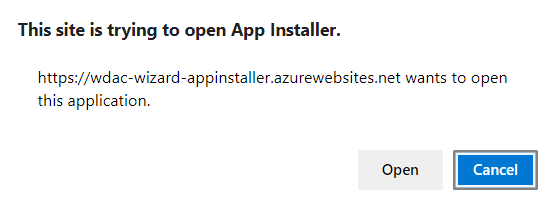

| [docs](..)  / [getting-started](.) / install-process.md
|:---|

# Installing the WDAC Policy Wizard

The WDAC CI policy wizard MSIX installer can be downloaded from the [WDAC Wizard App Host Site](https://bit.ly/3koHwYs) hosted on Azure. 

### Directions

  1. Simply click on the _Install the Windows Defender Application Control (WDAC) Wizard_ link to begin the download. 

**2. Permit the browser to begin install** by confirming to download the installer. Click _Open_ on Edge browsers. 

**3. Open the MSIX installer file** once the download has completed, if the installer is not automatically launched. 

**4. Install the Wizard** by clicking on the _Install_ button. 

The WDAC Wizard application will be installed and automatically launched after installation. A shortcut will be placed in the Start Menu. The application is sandboxed from the rest of the system. The app and its contents are installed to %PROGRAMFILES%\WindowsApps\.
